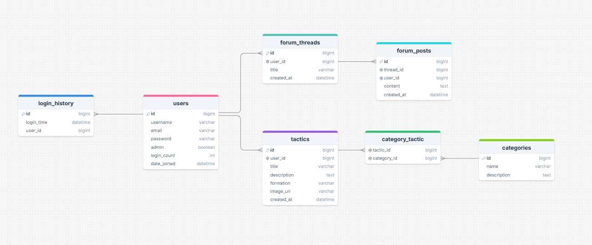

## Changelog:

## 16/10/2025

- View, Controller en Model gemaakt voor de tactics pagina, gevuld met dummy data
- Database migration gemaakt voor tactics
- ERD en userstories toegevoegd aan changelog (op 13/10/25 gemaakt maar nog niet toegevoegd)

## User Stories:

Als gebruiker wil ik:

- Voetbal tactieken toe kunnen voegen, verwijderen en aanpassen zodat ik deze goed kan organiseren (MUST HAVE)
- In kunnen loggen en registreren zodat ik mijn werk terug kan zien en aanpassen (MUST HAVE)
- Kunnen filteren tussen verschillende soorten tactieken zoals verdedigend of aanvallend zodat ik deze makkelijker terug
  kan vinden (MUST HAVE)
- Mijn favoriete tactieken aan kunnen geven zodat ik deze sneller terug kan vinden (SHOULD HAVE)
- Met andere gebruikers kunnen discussiëren over de tactieken die anderen hebben gemaakt (COULD HAVE)

Als admin wil ik:

- De gegevens van gebruikers kunnen verwijderen (MUST HAVE)
- De ingevoerde tactieken aan kunnen passen (MUST HAVE)
- Controle hebben over welke tactieken er op de site zichtbaar zijn (MUST HAVE)

## ERD Screenshot

